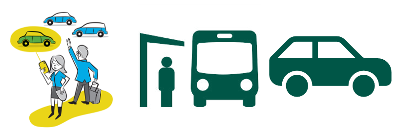
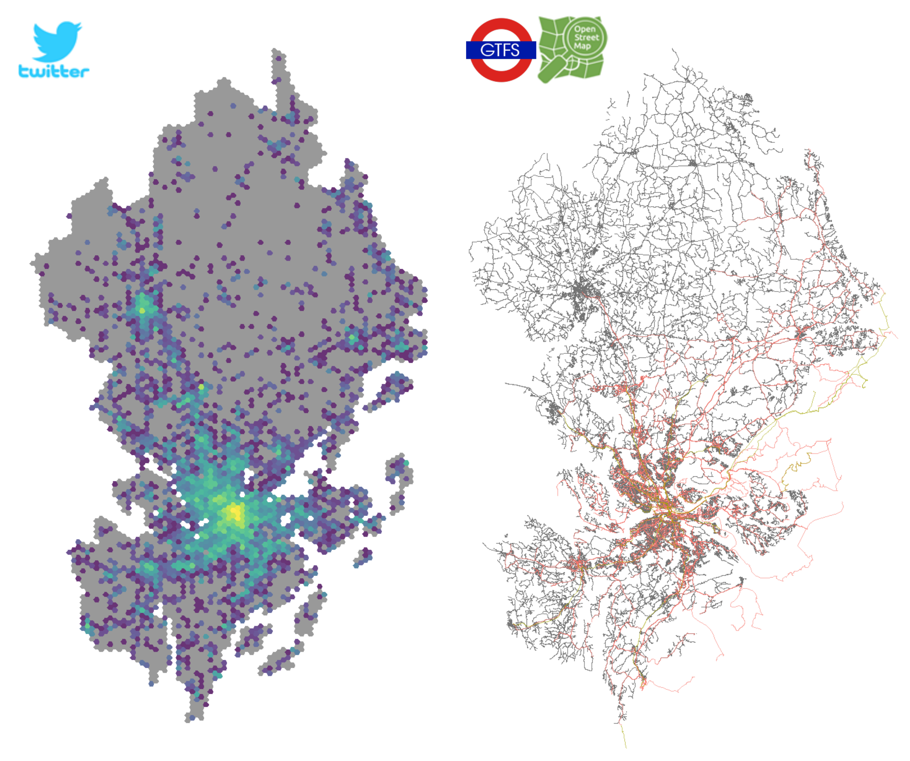
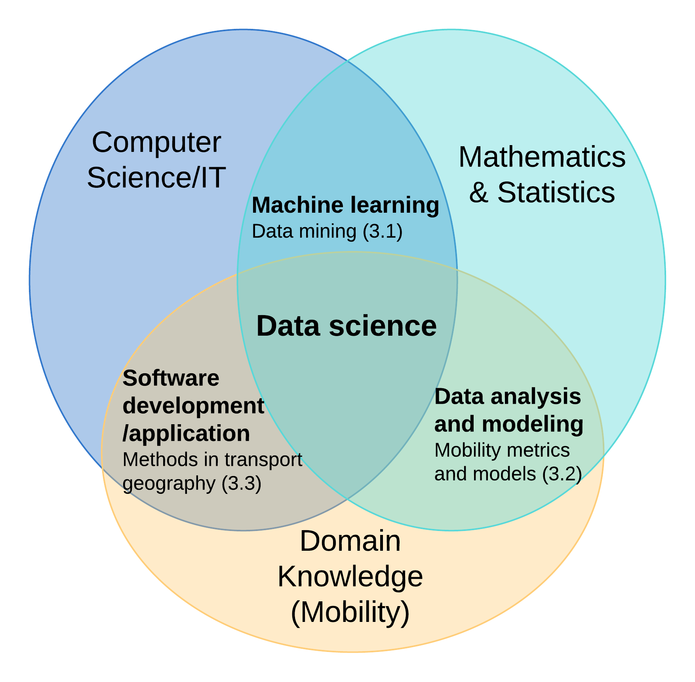

<style>
div.footnotes {
  position: absolute;
  bottom: 0;
  margin-bottom: 10px;
  width: 80%;
  font-size: 0.6em;
}
</style>

<script src="https://ajax.googleapis.com/ajax/libs/jquery/3.1.1/jquery.min.js"></script>
<script>
$(document).ready(function() {
  $('slide:not(.backdrop):not(.title-slide)').append('<div class=\"footnotes\">');

  $('footnote').each(function(index) {
    var text  = $(this).html();
    var fnNum = (index+1).toString();
    $(this).html(fnNum.sup());

    var footnote   = fnNum + '. ' + text + '<br/>';
    var oldContent = $(this).parents('slide').children('div.footnotes').html();
    var newContent = oldContent + footnote;
    $(this).parents('slide').children('div.footnotes').html(newContent);
  });
});
</script>

```{r setup, include=FALSE}
knitr::opts_chunk$set(echo = FALSE)
```

## What is human mobility?

The geographic displacement of human beings in space and time, seen as **individuals** or **groups**.
<footnote> Barbosa et al., 2018</footnote>


## How is human mobility supported by transport systems?

Through a variety of transport modes, e.g.,

<br><br>
<center>
```{r modes, echo = FALSE}

```
<br>
<span class="badge badge-pill badge-info">ride-sourcing</span> <span class="badge badge-pill badge-info">public transit</span> <span class="badge badge-pill badge-info">private car</span>
</center>
<br>
- **Transport modal disparities**
<br>
Different modes present distinct characteristics such as travel time and spatiotemporal distribution of trips.

## Background {.build .columns-2 .faster}

> - <p>Transportation presents a major challenge to curbing climate change.</p>

> - <p>Better informed policymaking requires up-to-date empirical data with **good quality**, **low cost**, and **easy access**.</p>

> - <p>Emerging data sources enable deep and new insights from large-scale collection of **human movement** and **transport systems**.</p>

<center>{width=100%}<p class="text-info">Tweets and road networks (car + public transit) in Stockholm region</p></center>


## Research questions and present work

1. What are the potentials and limitations of using emerging data sources for modelling mobility?

2. How can new data sources be properly modelled for characterising transport modal disparities?

<table class="table table-hover">
  <thead>
    <tr>
      <th scope="col">RQ</th>
      <th scope="col">#</th>
      <th scope="col">Scope</th>
      <th scope="col">Paper title</th>
    </tr>
  </thead>
  <tbody>
    <tr class="table-light">
      <th scope="row">1</th>
      <td>I</td>
      <td>Population heterogeneity</td>
      <td>From individual to collective behaviours: exploring population heterogeneity of human mobility based on social media data</td>
    </tr>
    <tr class="table-light">
      <th scope="row"></th>
      <td>II</td>
      <td rowspan="2" style="vertical-align : middle;">Travel demand</td>
      <td>Feasibility of estimating travel demand using geolocations of social media data</td>
    </tr>
    <tr class="table-light">
      <th scope="row"></th>
      <td>III</td>
      <td>A mobility model for synthetic travel demand from sparse individual traces</td>
    </tr>
    <tr class="table-active">
      <th scope="row">2</th>
      <td>IV</td>
      <td>Travel time</td>
      <td>Disparities in travel times between car and transit: spatiotemporal patterns in cities</td>
    </tr>
    <tr class="table-active">
      <th scope="row"></th>
      <td>V</td>
      <td>Modal competition</td>
      <td>Ride-sourcing compared to its public-transit alternative using big trip data</td>
    </tr>
  </tbody>
</table>

## Methodology {.columns-2}
<center>{width=100%}</center>
<br>
<br>
<table class="table table-hover">
  <thead>
    <tr>
      <td rowspan="2" style="vertical-align : middle;">Method</td>
      <td colspan="5"><center>Paper</center></td>
    </tr>
    <tr>
      <th scope="col">I</th>
      <th scope="col">II</th>
      <th scope="col">III</th>
      <th scope="col">IV</th>
      <th scope="col">V</th>
    </tr>
  </thead>
  <tbody>
    <tr class="table-light">
      <th scope="row">Data mining</th>
      <th scope="col">🗸</th>
      <th scope="col"></th>
      <th scope="col"></th>
      <th scope="col"></th>
      <th scope="col">🗸</th>
    </tr>
    <tr class="table-light">
      <th scope="row">Mobility metrics and models</th>
      <th scope="col">🗸</th>
      <th scope="col">🗸</th>
      <th scope="col">🗸</th>
      <th scope="col">🗸</th>
      <th scope="col">🗸</th>
    </tr>
    <tr class="table-light">
      <th scope="row">Methods in transport geography</th>
      <th scope="col"></th>
      <th scope="col"></th>
      <th scope="col"></th>
      <th scope="col">🗸</th>
      <th scope="col">🗸</th>
    </tr>
  </tbody>
</table>
