<style>
div.footnotes {
  position: absolute;
  bottom: 0;
  margin-bottom: 10px;
  width: 80%;
  font-size: 0.6em;
}
</style>

<script src="https://ajax.googleapis.com/ajax/libs/jquery/3.1.1/jquery.min.js"></script>
<script>
$(document).ready(function() {
  $('slide:not(.backdrop):not(.title-slide)').append('<div class=\"footnotes\">');

  $('footnote').each(function(index) {
    var text  = $(this).html();
    var fnNum = (index+1).toString();
    $(this).html(fnNum.sup());

    var footnote   = fnNum + '. ' + text + '<br/>';
    var oldContent = $(this).parents('slide').children('div.footnotes').html();
    var newContent = oldContent + footnote;
    $(this).parents('slide').children('div.footnotes').html(newContent);
  });
});
</script>

```{r setup, include=FALSE}
knitr::opts_chunk$set(echo = FALSE)
library(emojifont)
```


## Background {.build data-background="figs/transportation_background.png"}
<div>
- <p>Transportation presents a major challenge to curbing climate change.</p>
</div>

<div>
- <p>Better informed policymaking requires up-to-date empirical data with **good quality**, **low cost**, and **easy access**.</p>
</div>

<div>
- <p>Emerging data sources enable deep and new insights from large-scale collection of **human movement** and **transport systems**.</p>

<center>{width=80%}</center>
</div>


## What is human mobility?

The geographic displacement of human beings in space and time, seen as **individuals** or **groups**.
<footnote> Barbosa et al., 2018</footnote>

<div id="images">
  <figure>
      <figcaption><p><small>Individual movements</small></p></figcaption>
      
  </figure>
  <figure>
      <figcaption><p><small>Trips from groups of people</small></p></figcaption>
      
  </figure>
</div>

## How is human mobility supported by transport systems? {.build}
<div>
Through a variety of transport modes, e.g.,

<br>
<center>
{width=40%}
<br>
<span class="badge badge-pill badge-info">ride-sourcing</span> <span class="badge badge-pill badge-info">public transit</span> <span class="badge badge-pill badge-info">private car</span>
</center>
</div>

<br>
<div>
<p>**Transport modal disparities**</p>
- <p>Carbon intensity</p>
- <p>Spatiotemporal distributions of travel time and trips</p>
</div>


## Research questions and present work {.build}

<div>
<p>RQ1 What are the potentials and limitations of using emerging data sources for modelling mobility?</p>
</div>

<div>
<p>RQ2 How can new data sources be properly modelled for characterising transport modal disparities?</p>
</div>

<div>
<table class="table table-hover">
  <thead>
    <tr>
      <th scope="col">RQ</th>
      <th scope="col">#</th>
      <th scope="col">Scope</th>
      <th scope="col">Paper title</th>
    </tr>
  </thead>
  <tbody>
    <tr class="table-light">
      <th scope="row">1</th>
      <td>I</td>
      <td>Population heterogeneity</td>
      <td>From individual to collective behaviours: exploring population heterogeneity of human mobility based on social media data</td>
    </tr>
    <tr class="table-light">
      <th scope="row"></th>
      <td>II</td>
      <td rowspan="2" style="vertical-align : middle;">Travel demand</td>
      <td>Feasibility of estimating travel demand using geolocations of social media data</td>
    </tr>
    <tr class="table-light">
      <th scope="row"></th>
      <td>III</td>
      <td>A mobility model for synthetic travel demand from sparse individual traces</td>
    </tr>
    <tr class="table-active">
      <th scope="row">2</th>
      <td>IV</td>
      <td>Travel time</td>
      <td>Disparities in travel times between car and transit: spatiotemporal patterns in cities</td>
    </tr>
    <tr class="table-active">
      <th scope="row"></th>
      <td>V</td>
      <td>Modal competition</td>
      <td>Ride-sourcing compared to its public-transit alternative using big trip data</td>
    </tr>
  </tbody>
</table>
</div>

## Methodology

<center>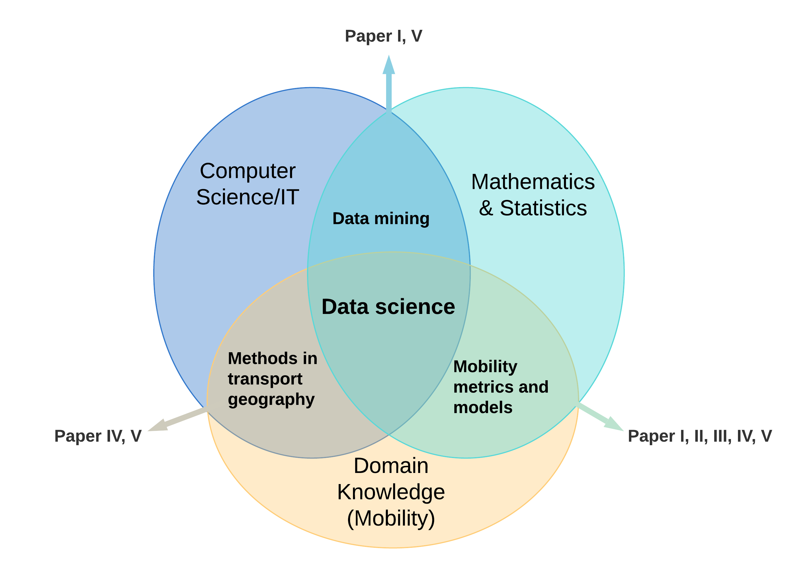{width=80%}</center>

# RQ1 What are the potentials and limitations of using geotagged tweets for modelling mobility?

## RQ1 Geotagged tweets, pros and cons {.build}
<table>
  <tbody>
    <tr>
      <th scope="row"><center>{width=80%}</center></th>
      <td><p><h4>Geotagged tweets</h4><br><h6>The tweets with precise location information (GPS coordinates) when Twitter users actively choose to tag it.</h6></p></td>
    </tr>
  </table>
</table>

<div>    
- <p>Why Twitter?</p>

  - <p>Easy access, low cost, large spatial and population coverage.</p>
</div>

<div> 
- <p>Limitations of geotagged tweets</p>

  - <p>Biased population: young, highly-educated, urban residents.</p>
  - <p>**Sparse sampling** of the actual mobility.</p>
  - <p>**Behaviour bias** of reporting geolocations.</p>
</div>

## RQ1 Limitations: sparse sampling of the actual mobility | (Paper III){.build}
<div style="float: left; width: 49%;">
- <p>Twitter users DO NOT geotweet every day.</p>

<center>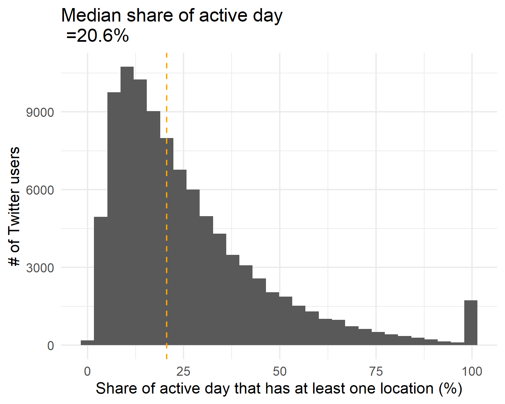{width=80%}</center>
</div>

<div style="float: right; width: 49%;">
- <p>Twitter users DO NOT geotweet every location visited.</p>

<center>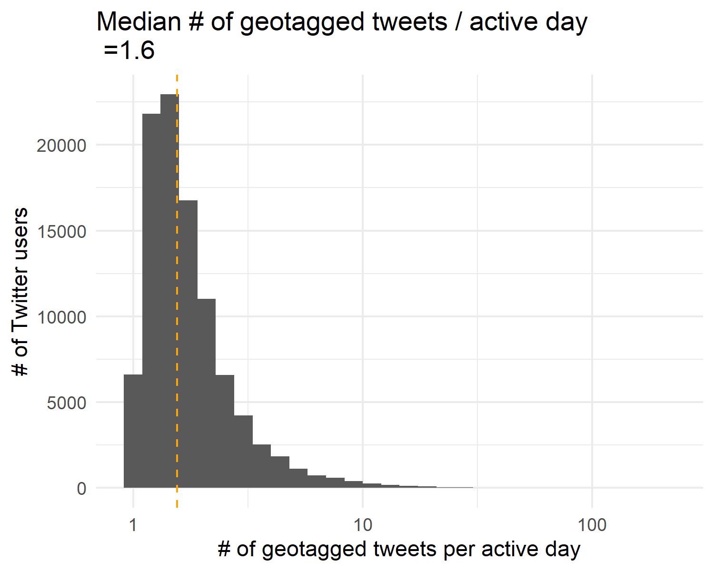{width=80%}</center>
</div>

## RQ1 Limitations: behaviour bias of overly reporting leisure/night activities | (Paper I){.build}
<div> 
Uncommon places and leisure activities more than regularly visited places, e.g., home and workplace.
</div>

<div> 
<center>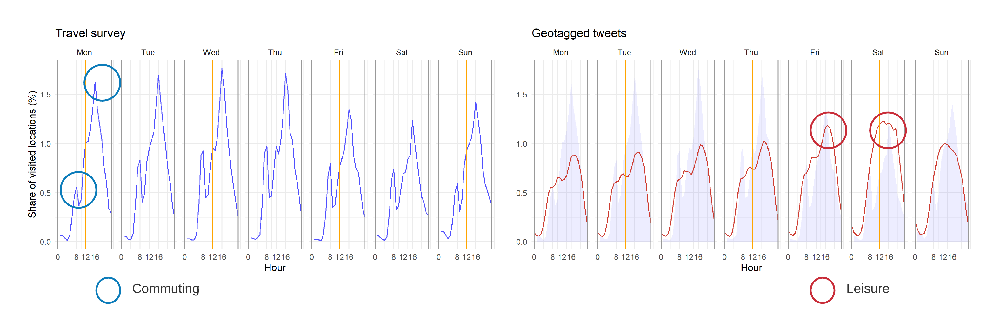{width=100%}</center>
</div>

## RQ1 Limitations: not for commuting travel demand estimation | (Paper II){.build}

<div> 
The reliability of estimated commuting trips using geotagged tweets is low.
</div>

<div>
<center><p><small>Commuting trip distance distributions</small></p></center>

<center>{width=40%}</center>

</div>


## RQ1 Potentials at individual level: population heterogeneity on mobility | (Paper I) {.build}

<div style="float: left; width: 50%;">
<center><p><small>Four types of travellers</small></p></center>

<center>{width=90%}</center>
</div>

<div style="float: right; width: 50%;">
- <p>Local vs. Global traveller visits </p>
  - <p>Local: nearby locations.</p>
  - <p>Global: more distant locations.</p>
</div>

<div style="float: right; width: 50%;">
- <p>Returner vs. Explorer explores around </p>
  - <p>Returner: one centralised location.</p>
  - <p>Explorer: decentralised locations that are distant from each other.</p>
</div>

## RQ1 Potentials at population level: travel demand modelling | (Paper II) {.build}
<table>
  <tbody>
    <tr>
      <th width="20%" scope="row"><span class="badge rounded-pill bg-primary" style="color:white">spatial scale</span></th>
      <td><p style="font-size:26px">Twitter data are more suitable for **city level** than national level (in Sweden).</p></td>
    </tr>
  </table>
</table>

<table>
  <tbody>
    <tr>
      <th width="20%" scope="row"><span class="badge rounded-pill bg-primary" style="color:white">sampling method</span></th>
      <td><p style="font-size:26px">**User-based** data collection works better than area-based data collection.</p></td>
    </tr>
  </table>
</table>

<table>
  <tbody>
    <tr>
      <th width="20%" scope="row"><span class="badge rounded-pill bg-primary" style="color:white">sample size</span></th>
      <td><p style="font-size:26px">A much larger number of geotagged tweets, a more complete picture of travel demand.</p></td>
    </tr>
  </table>
</table>


## RQ1 Extending the use by innovative approaches | (Paper II) {.build}

<div>
<p>A density-based approach is proposed to increase **sample size** for estimating travel demand.</p>
</div>

<div style="float: left; width: 33%;">
<p><small>Trip-based approach in the literature<footnote>Lee et al., 2019</footnote></small></p>
<center>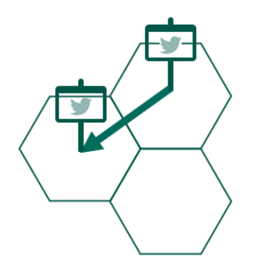{width=80%}</center>
</div>

<div style="float: right; width: 66%;">
<p><small>Our density-based approach</small></p>
<center>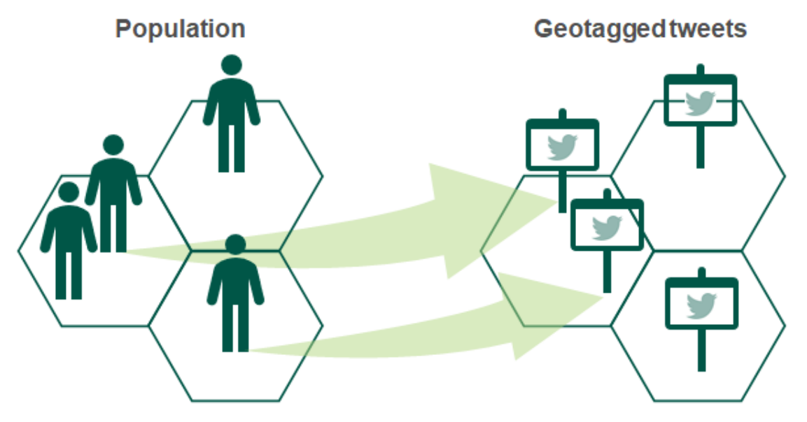{width=80%}</center>
</div>

<div>
<p>increases the accuracy of the estimation by 10%--60%.</p>
</div>

## RQ1 Extending the use by innovative approaches | (Paper III) {.build}

<div>
- <p>**An individual-based mobility model** is proposed to fill the gaps in sparse mobility data.</p>
- <p>The model is designed to correct behaviour bias and sparsity issue.</p>
</div>

<div style="float: left; width: 33%;">
<p><small>**Input**- sparse mobility traces.</small></p>
<center>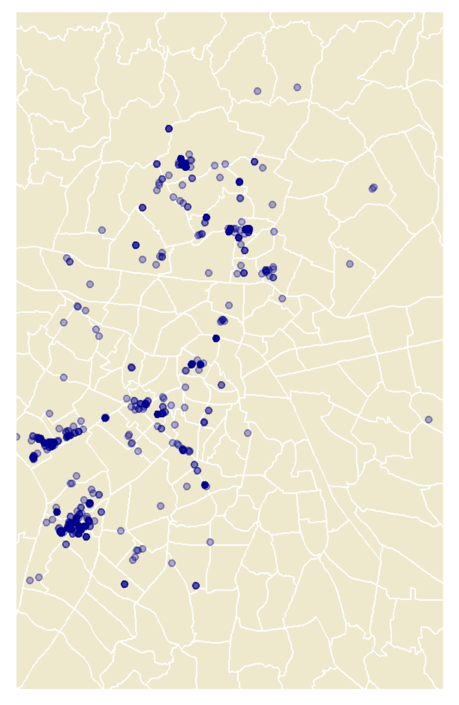{width=55%}</center>
</div>

<div style="float: right; width: 66%;">
<p><small>**Output**- synthesised mobility converted to daily trips.</small></p>
<center>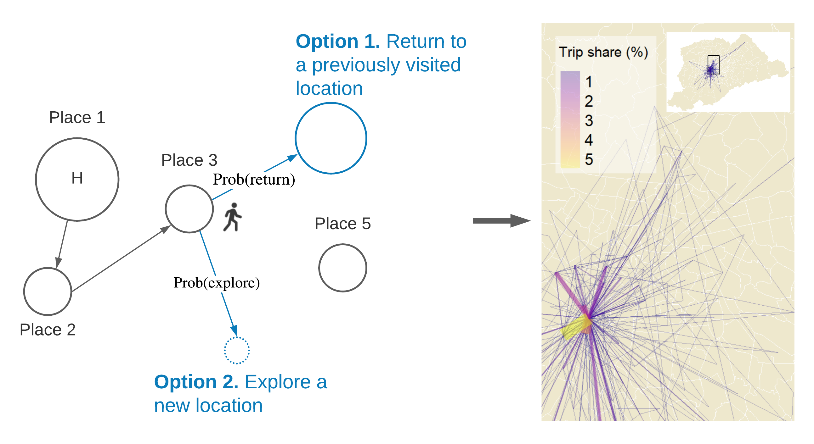{width=85%}</center>
</div>

## RQ1 Extending the use by innovative approaches | (Paper III) {.build}
<div>
- <p>The model-synthesised results have good performance.</p>
</div>

<div>
- <p>An application: characterising trip distance distributions (domestic) of global regions' residents:</p>

<center>{width=95%}</center>
</div>

## A summary of answers to RQ1 | Potentials and limitations of geotagged tweets for modelling mobility {.build}

<div>
- <p>`r emoji('o')` `r emoji('heavy_exclamation_mark')` Easy access, low cost, but with biased population, behaviour bias, and sparsity issue.</p>
</div>

<div>
- <p>`r emoji('bust_in_silhouette')` At the individual level, fundamental patterns are preserved.</p>
</div>

<div>
- <p>`r emoji('busts_in_silhouette')` At the population level: </p> 
  - <p>a reasonably good source for the overall travel demand estimation but not commuting demand.</p>

  - <p>careful consideration on spatial scale, sampling method, and sample size.</p>
</div>

<div>
- <p>`r emoji('wrench')` Innovative approaches for correcting the biases and increasing available data.</p>
</div>

# RQ2 How can new data sources be properly modelled for characterising transport modal disparities?

## RQ2 Spatiotemporal patterns of travel time: data fusion approach | (Paper IV) {.build}
<div style="float: left; width: 40%;">
Data fusion framework for travel time calculation:

<center>{width=100%}</center>
</div>

<div style="float: right; width: 57%;">
Distribution of geotagged tweets represents the dynamic attractiveness of locations in cities.

<center>{width=60%}</center>
</div>

## RQ2 Spatiotemporal patterns of travel time | (Paper IV) {.build}
<div style="float: left; width: 50%;">
<center><p><small>Travel time ratio (R) by hour of day (Sydney)</p></small></center>
<center>{width=90%}</center>
</div>

<div style="float: right; width: 50%;">
<center><p><small>Travel time ratio (R) over 24 hours</p></small></center>
<center>{width=80%}</center>

- <p>Travel time by PT is around twice as high as by car.</p>
- <p>PT can compete with car use during peak rush hours in Stockholm and Amsterdam.</p>

</div>

## RQ2 Modal competition: ride-sourcing vs. public transit | (Paper V) {.build}
<div>
<table>
  <tbody>
    <tr>
      <th scope="row"><center>{width=60%}</center></th>
      <td><p><h5>Does ride-sourcing complement, or compete with, public transit?</h5></p></td>
    </tr>
  </table>
</table>
</div>

<div>

- <p class="text-info">How large is the share of ride-sourcing trips that can be **substituted** by taking public transit, if you are willing to walk up to **800 m** to access and leave the transit station during daytime?</p>

</div>

<div>
- <p>Ride-sourcing trips: transit-competing vs. non-transit-competing.</p>
  - <p>What **trip attributes** and **built environment** are linked to the competition?</p>
  - <p>What are the implications for policymaking?</p>
</div>

## RQ2 Modal competition: ride-sourcing vs. public transit | (Paper V) {.build}
<div>
- <p>The transit-competing trips account for 48.2% of the overall 4.3 million ride-sourcing trips.</p>

<center><p><small>Hot spots of ride-sourcing trips</p></small></center>
<center>{width=100%}</center>
</div>

## RQ2 Modal competition: data fusion approach and model | (Paper V) {.build}

- <p>Big mode-specific trip data are often collected from a large area and population, but at a cost of **rich detail**.</p>

<div style="float: left; width: 20%;">
<table class="table table-hover">
  <thead>
    <tr class="table-active">
      <th scope="row">Raw data</th>
    </tr>
  </thead>
  <tbody>
    <tr class="table-active">
      <th scope="row">trip ID</th>
    </tr>
    <tr class="table-active">
      <th scope="row">pick-up/drop-off locations</th>
    </tr>
    <tr class="table-active">
      <th scope="row">pick-up/drop-off times</th>
    </tr>
    <tr class="table-active">
      <th scope="row">cost</th>
    </tr>
  </tbody>
</table>
</div>

<div style="float: right; width: 79%;">
<table class="table table-hover">
  <thead>
    <tr class="table-light">
      <th scope="row"></th>
      <th scope="row">Enriched variables</th>
    </tr>
  </thead>
  <tbody>
    <tr class="table-light">
      <th scope="row">Trip attributes</th>
      <th scope="row">`r emoji('bus')` public transit information, e.g., travel time</th>
    </tr>
    <tr class="table-light">
      <th scope="row"></th>
      <th scope="row">`r emoji('sunny')` weather condition</th>
    </tr>
    <tr class="table-light">
      <th scope="row"></th>
      <th scope="row">`r emoji('spider_web')` demand-based communities (by trip-based network)</th>
    </tr>
    <tr class="table-light">
      <th scope="row">Built environment</th>
      <th scope="row">`r emoji('busstop')` transit-stop density</th>
    </tr>
    <tr class="table-light">
      <th scope="row"></th>
      <th scope="row">`r emoji('hotel')` functional regions (by points of interest)</th>
    </tr>
  </tbody>
</table>
</div>

<div style="float: left; width: 100%;">
- <p>A glass-box model enhanced by machine learning techniques: **additive** impact of **variables** and variable **interactions**.</p>
</div>

## RQ2 Modal competition: impact of land-use | (Paper V) {.build}

<div style="float: left; width: 49%;">
<p>Land-use clusters of the study area</p>
<center>{width=100%}</center>
</div>


<div style="float: right; width: 49%;">
<center>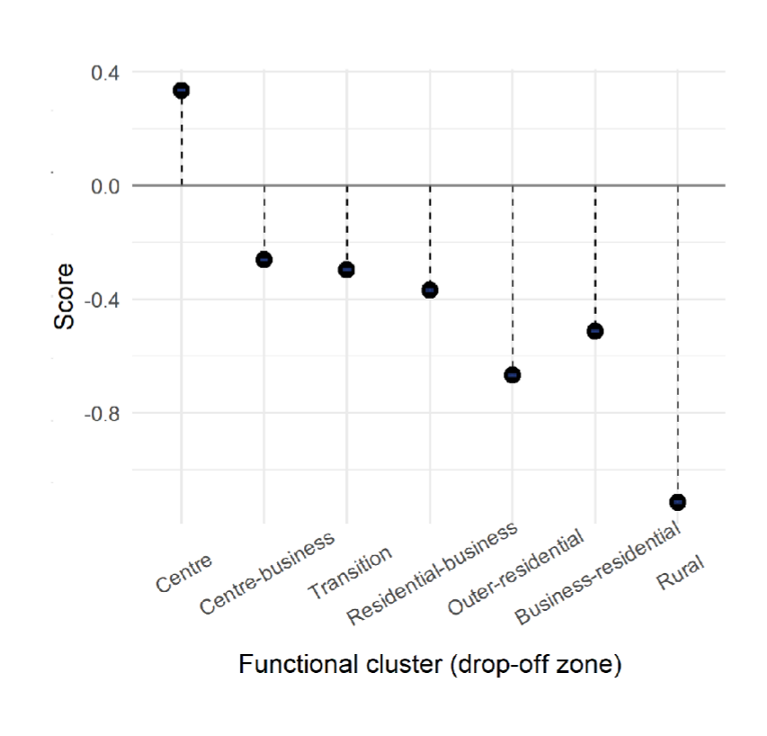{width=82%}</center>
</div>

<div style="float: left; width: 100%;">
- <p>Low density/diversity of **land use** -> a lower probability of competition.</p>
</div>

## RQ2 Modal competition: impact of land-use x transit boardings | (Paper V) {.build}

<div style="float: left; width: 49%;">
<p>Land-use clusters of the study area</p>
<center>{width=100%}</center>
</div>


<div style="float: right; width: 49%;">
<center>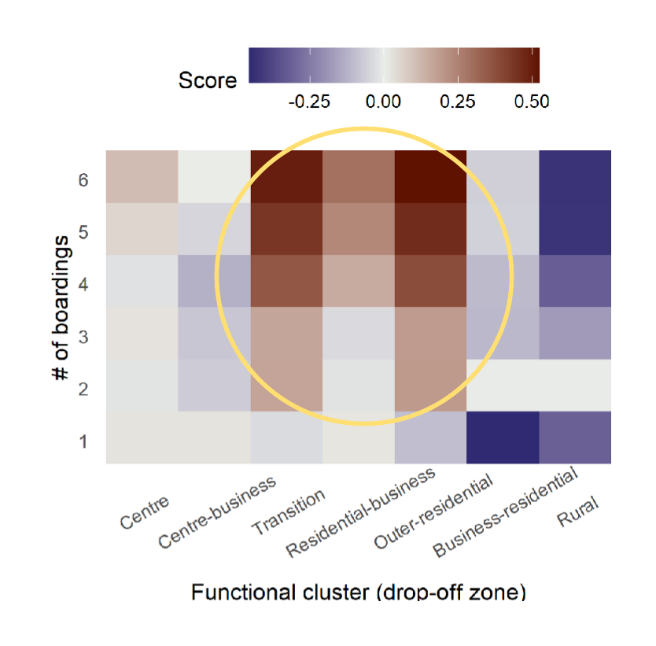{width=82%}</center>
</div>

<div style="float: left; width: 100%;">
- <p>Multiple **transfers** + middle density/diversity of **land use** -> a higher probability of competition.</p>
</div>

## RQ2 Modal competition: selective recommendations | (Paper V) {.build}

<div>
- <p>`r emoji('bus')` Expand PT networks guided by the transit-competing ride-sourcing trips featuring</p>
  - <p>short travel time by ride-sourcing (< 15 min)</p>
  - <p>large travel time ratio between the two modes;</p>
</div>

<div>
- <p>`r emoji('moneybag')` Incentivise the ride-sourcing trips that fill the gaps in the PT services which</p>
  - <p>take a long time</p>
  - <p>require lengthy walking</p>
  - <p>require multiple transfers connecting to suburban areas.</p>
</div>

## A summary of answers to RQ2 | Characterising transport modal disparities between public transit and car & ride-sourcing {.build}

<div>
- <p>`r emoji('package')` Importance of data fusion approaches, especially given more and more open but incomplete data.</p>
</div>

<div>
- <p>{width=3%} Geotagged tweets is a good source for time-varying attractiveness of urban locations.</p>
</div>

<div>
- <p>`r emoji('bus')` `r emoji('car')` Public transit is virtually always slower than car and ride-sourcing.</p>
</div>

<div>
- <p>`r emoji('round_pushpin')` For making public transit more competitive, spatiotemporal details add nuanced insights to identify gaps and opportunities.</p>
</div>

## Knowledge contributions {.build}
<center>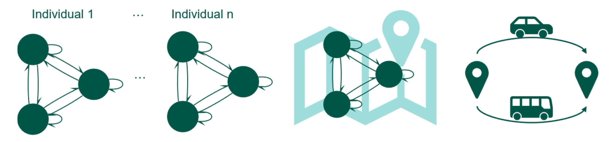{width=80%}</center>

<div>
- <p>Provide validation to identify the limitations of geotagged tweets: **behavior bias**, **biased population**, and **sparsity issue**.</p>
</div>

<div>
- <p>Reveal the potentials of geotagged tweets at both **individual** and **population** level.</p>
</div>

<div>
- <p>Reveal the spatio-temporal disparities between car/ride-sourcing and public transit about **travel time** and **modal competition**.</p>
</div>

## Methodological contributions {.build}
<center>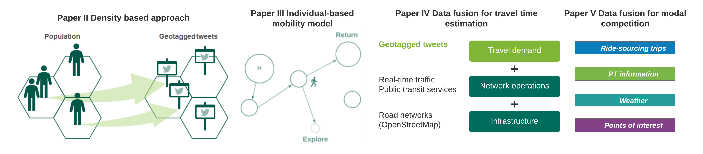{width=100%}</center>

<div>
- <p>Propose **a density approach** and **an individual-based mobility model** for travel demand estimation, addressing sparsity issue and behaviour bias of geotagged tweets.</p>
</div>

<div>
- <p>Create two reproducible **data fusion frameworks** integrating multiple data sources from transport systems for characterising modal disparities.</p>
</div>

## Outlook {.build}
<div>
- <p>{width=3%} Extending the use of social media data for mobility modelling.</p>
</div>

<div>
- <p>`r emoji('globe_with_meridians')` Generating global synthetic mobility data for improving travel demand projections.</p>
</div>

<div>
- <p>`r emoji('blue_car')` & `r emoji('tram')` `r emoji('bike')` `r emoji('taxi')` `r emoji('bus')` `r emoji('train')` Combining multi-modal trip data to explore occupancy, shareability, and electrification of new mobility services for reducing transport carbon emissions.</p>
</div>

<div>
- <p>`r emoji('spider_web')` Introducing the perspective of networks.</p>
</div>

## Thanks for listening! {data-background="figs/end_background.png"}
Yuan Liao

`r emoji('e-mail')` yuan.liao@chalmers.se

{width=3%} [\@TheYuanLiao](https://twitter.com/TheYuanLiao)

`r emoji('globe_with_meridians')` https://yuanliao.netlify.app/

<br>

<div style="float: left; width: 70%;">
`r emoji('green_book')`Thesis available online

https://research.chalmers.se/en/publication/523982
</div>

<div style="float: right; width: 30%;">
{width=50%}
</div>
