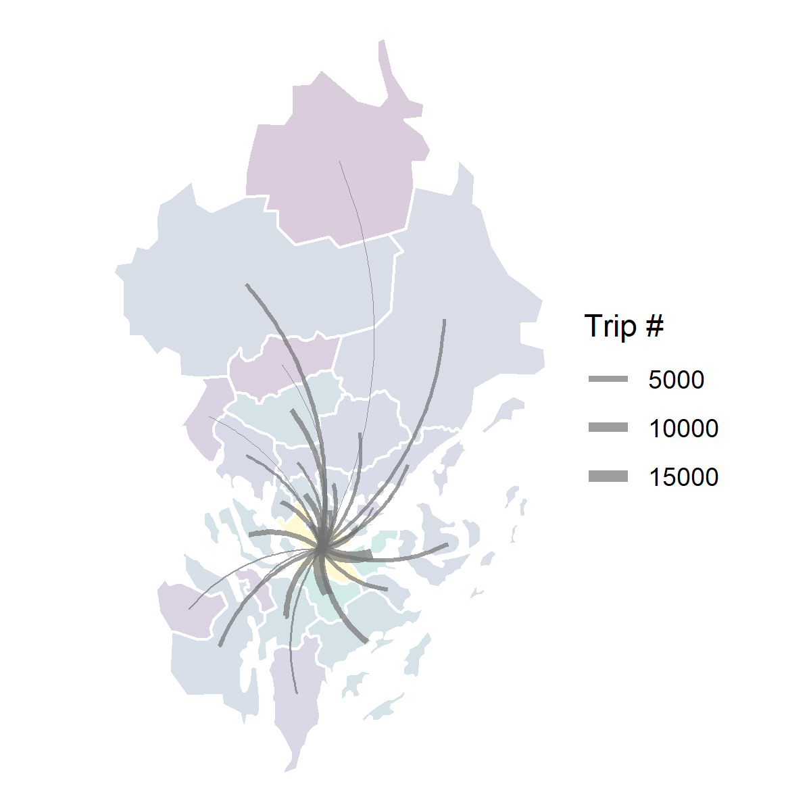
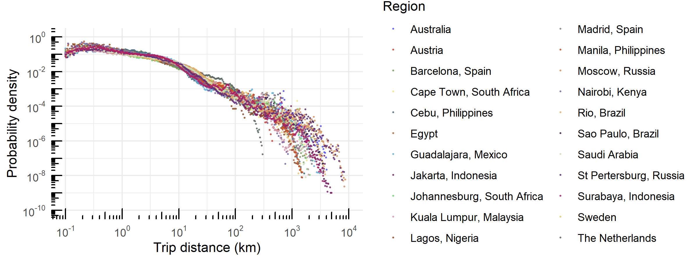

<style>
div.footnotes {
  position: absolute;
  bottom: 0;
  margin-bottom: 10px;
  width: 80%;
  font-size: 0.6em;
}
</style>

<script src="https://ajax.googleapis.com/ajax/libs/jquery/3.1.1/jquery.min.js"></script>
<script>
$(document).ready(function() {
  $('slide:not(.backdrop):not(.title-slide)').append('<div class=\"footnotes\">');

  $('footnote').each(function(index) {
    var text  = $(this).html();
    var fnNum = (index+1).toString();
    $(this).html(fnNum.sup());

    var footnote   = fnNum + '. ' + text + '<br/>';
    var oldContent = $(this).parents('slide').children('div.footnotes').html();
    var newContent = oldContent + footnote;
    $(this).parents('slide').children('div.footnotes').html(newContent);
  });
});
</script>

```{r setup, include=FALSE}
knitr::opts_chunk$set(echo = FALSE)
```

## What is human mobility?

The geographic displacement of human beings in space and time, seen as **individuals** or **groups**.
<footnote> Barbosa et al., 2018</footnote>

<div id="images">
  <figure>
      
      <figcaption><p><small>Fig. 1 Individual movements.</small></p></figcaption>
  </figure>
  <figure>
      
      <figcaption><p><small>Fig. 2 Population trips.</small></p></figcaption>
  </figure>
</div>

## How is human mobility supported by transport systems?

Through a variety of transport modes, e.g.,

<br>
<center>
{width=40%}
<br>
<span class="badge badge-pill badge-info">ride-sourcing</span> <span class="badge badge-pill badge-info">public transit</span> <span class="badge badge-pill badge-info">private car</span>
</center>
<br>
<p>**Transport modal disparities**</p>
- <p>Carbon intensity</p>
- <p>Spatiotemporal distributions of travel time and trips</p>

## Background {.build}

<div style="float: left; width: 50%;">
- <p>Transportation presents a major challenge to curbing climate change.</p>
- <p>Better informed policymaking requires up-to-date empirical data with **good quality**, **low cost**, and **easy access**.</p>
- <p>Emerging data sources enable deep and new insights from large-scale collection of **human movement** and **transport systems**.</p>
</div>

<div style="float: right; width: 50%;">
<center>{width=100%}<p><small>Fig. 3 Tweets and road networks (car + public transit) in Stockholm region</small></p></center>
</div>

## Research questions and present work

1. What are the potentials and limitations of using emerging data sources for modelling mobility?

2. How can new data sources be properly modelled for characterising transport modal disparities?

<table class="table table-hover">
  <thead>
    <tr>
      <th scope="col">RQ</th>
      <th scope="col">#</th>
      <th scope="col">Scope</th>
      <th scope="col">Paper title</th>
    </tr>
  </thead>
  <tbody>
    <tr class="table-light">
      <th scope="row">1</th>
      <td>I</td>
      <td>Population heterogeneity</td>
      <td>From individual to collective behaviours: exploring population heterogeneity of human mobility based on social media data</td>
    </tr>
    <tr class="table-light">
      <th scope="row"></th>
      <td>II</td>
      <td rowspan="2" style="vertical-align : middle;">Travel demand</td>
      <td>Feasibility of estimating travel demand using geolocations of social media data</td>
    </tr>
    <tr class="table-light">
      <th scope="row"></th>
      <td>III</td>
      <td>A mobility model for synthetic travel demand from sparse individual traces</td>
    </tr>
    <tr class="table-active">
      <th scope="row">2</th>
      <td>IV</td>
      <td>Travel time</td>
      <td>Disparities in travel times between car and transit: spatiotemporal patterns in cities</td>
    </tr>
    <tr class="table-active">
      <th scope="row"></th>
      <td>V</td>
      <td>Modal competition</td>
      <td>Ride-sourcing compared to its public-transit alternative using big trip data</td>
    </tr>
  </tbody>
</table>

## Methodology {.columns-2}
<center>{width=90%}<p><small>Fig. 4 Methodology</small></p></center>

<br>
<br>
<table class="table table-hover">
  <thead>
    <tr>
      <td rowspan="2" style="vertical-align : middle;">Method</td>
      <td colspan="5"><center>Paper</center></td>
    </tr>
    <tr>
      <th scope="col">I</th>
      <th scope="col">II</th>
      <th scope="col">III</th>
      <th scope="col">IV</th>
      <th scope="col">V</th>
    </tr>
  </thead>
  <tbody>
    <tr class="table-light">
      <th scope="row">Data mining</th>
      <th scope="col">🗸</th>
      <th scope="col"></th>
      <th scope="col"></th>
      <th scope="col"></th>
      <th scope="col">🗸</th>
    </tr>
    <tr class="table-light">
      <th scope="row">Mobility metrics and models</th>
      <th scope="col">🗸</th>
      <th scope="col">🗸</th>
      <th scope="col">🗸</th>
      <th scope="col">🗸</th>
      <th scope="col">🗸</th>
    </tr>
    <tr class="table-light">
      <th scope="row">Methods in transport geography</th>
      <th scope="col"></th>
      <th scope="col"></th>
      <th scope="col"></th>
      <th scope="col">🗸</th>
      <th scope="col">🗸</th>
    </tr>
  </tbody>
</table>

## RQ1 Potentials and limitations of geotagged tweets {.build}
<table>
  <tbody>
    <tr>
      <th scope="row"><center>{width=80%}</center></th>
      <td><p><h4>Geotagged tweets</h4><br><h6>The tweets with precise location information (GPS coordinates) when Twitter users actively choose to tag it.</h6></p></td>
    </tr>
  </table>
</table>

<div>    
- <p>Why Twitter?</p>

  - <p>Easy access, low cost, large spatial and population coverage.</p>
</div>

<div> 
- <p>Limitations of geotagged tweets</p>

  - <p>Biased population: young, highly-educated, urban residents.</p>
  - <p>**Sparse sampling** of the actual mobility.</p>
  - <p>**Behaviour bias** of reporting geolocations.</p>
</div>
## Limitations: sparse sampling of the actual mobility {.build}
- <p>Twitter users DO NOT geotweet every day.</p>
- <p>Twitter users DO NOT geotweet every location visited.</p>

<center>{width=80%}<p><small>Fig. 5 Sparsity issue.<footnote>Data used in Paper III</footnote></small></p></center>

## Limitations: behaviour bias of overly reporting leisure/night activities

Uncommon places and leisure activities >> regularly visited places, e.g., home and workplace.

<center>{width=80%}<p><small>Fig. 6 Behaviour bias.<footnote>Data used in Paper I</footnote></small></p></center>

## Limitations: not for commuting travel demand estimation

The reliability of estimated commuting trips using geotagged tweets is low.

<center>{width=100%}<p><small>Fig. 7 Commuting trips. (A) Survey and user-based collected geolocations (Twitter LD). (B) Commuting trip distance distribution produced by Twitter in comparison with Survey.<footnote>Paper II</footnote></small></p></center>

## Potentials at individual level: population heterogeneity on mobility {.build}

<div style="float: left; width: 50%;">  
<center>{width=100%}<p><small>Fig. 8 Four types of travellers.<footnote>Paper I</footnote></small></p></center>
</div>

<div style="float: right; width: 50%;">
- <p>Local vs. Global traveller visits </p>
  - <p>Local: nearby locations.</p>
  - <p>Global: more distant locations.</p>

- <p>Returner vs. Explorer explores around </p>
  - <p>Returner: one centralised location.</p>
  - <p>Explorer: decentralised locations that are distant from each other.</p>
</div>


## Potentials at population level: travel demand modelling {.build}

<div>
  <span class="badge bg-light">spatial scale</span> 
  <span class="badge bg-secondary">sampling method</span> 
  <span class="badge bg-secondary">sample size</span>
</div>

<div>
- <p>Twitter data are more suitable for **city level** than national level.</p>
- <p>The main obstacle of using Twitter data at a large spatial scale is the **sparsity**.</p>

<center>{width=35%}<p><small>Fig. 9 National level (left) vs. city level (right).<footnote>Paper II</footnote></small></p></center>

</div>

## Potentials at population level: travel demand modelling {.build}

<div>
  <span class="badge bg-secondary">spatial scale</span> 
  <span class="badge bg-light">sampling method</span> 
  <span class="badge bg-light">sample size</span>
  
- <p>**User-based** data collection works better than area-based data collection:</p>
<p>A much larger number of geotagged tweets, a more complete picture of travel demand.</p>
</div>

<div>
- <p>**A density-based approach** is proposed to increase sample size:</p>
<center>{width=50%}<p><small>Fig. 10 Trip-based approach (left)<footnote>Lee et al., 2019</footnote> vs. density-based approach (right).<footnote>Paper II</footnote></small></p></center>
</div>

## Extending the use by innovative approaches {.build}
<div>
<span class="badge bg-secondary">A density-based approach</span> 
<span class="badge bg-light">A mobility model</span>

- <p>**An individual-based mobility model**<footnote>Paper III</footnote> fills the gaps in sparse mobility data, particularly geolocations of social media data.</p>
- <p>The model is designed to correct behaviour bias and sparsity issue.</p>
</div>

<div>
<table style="white-space:nowrap;width:100%;">
  <tr>
    <td><p style="font-size:24px">Input: sparse mobility traces <br>that can not be directly converted to trips.</p></td>
    <td rowspan="2"><center>{width=65%}</center></td>
  </tr>
  <tr>
    <td><p style="font-size:24px">Output: synthesised mobility <br>converted to daily trips.</p></td>
  </tr>
</table>
</div>

## Extending the use by innovative approaches {.build}
<div>
<span class="badge bg-secondary">A density-based approach</span> 
<span class="badge bg-light">A mobility model</span>

- <p>The model-synthesised results have good agreements with the other data sources.</p>
</div>

<div>
- <p>Characterising trip distance distributions (domestic) of global regions:</p>

<center>{width=100%}<p><small>Fig. 11 Distributions of synthesised domestic trips.<footnote>Paper III</footnote></small></p></center>
</div>

## RQ2 Transport modal disparities
### Movements in context, data beyond geotagged tweets
<center>{width=60%}</center>

## Spatiotemporal patterns of travel time {.build}
<div style="float: left; width: 40%;">
Data fusion framework for travel time calculation<footnote>Paper IV</footnote>:

<center>{width=100%}</center>
</div>

<div style="float: right; width: 57%;">
Distributions of geotagged tweets represents the dynamic attractiveness of locations in cities.

<center>{width=60%}<p><small>Fig. 12 Geotagged tweets as destinations by hour of day (Stockholm region).</p></small></center>
</div>

## Spatiotemporal patterns of travel time {.build}
<div style="float: left; width: 50%;">
Spatiotemporal dynamics of travel time ratio (R)<footnote>Paper IV</footnote>:

<center>{width=80%}<p><small>Fig. 13 Travel time ratio by hour of day (Sydney).</p></small></center>
</div>

<div style="float: right; width: 50%;">
- <p>Travel time by PT is around twice as high as by car.</p>
- <p>PT can compete with car use during peak rush hours in Stockholm and Amsterdam.</p>

<center>{width=80%}<p><small>Fig. 14 Travel time ratio over 24 hours.</p></small></center>
</div>

## Modal competition: ride-sourcing vs. public transit {.build}
<div>
<table>
  <tbody>
    <tr>
      <th scope="row"><center>{width=80%}</center></th>
      <td><p><h4>Does ride-sourcing complement, or compete with, public transit?</h4></p></td>
    </tr>
  </table>
</table>
</div>

<div>

- <p class="text-info">How large is the share of ride-sourcing trips that can be **substituted** by taking public transit, if you are willing to walk up to **800 m** to access and leave the transit station during daytime?</p>

</div>

<div>
- <p>Ride-sourcing trips: transit-competing vs. non-transit-competing.</p>
  - <p>What **trip attributes** and **built environment** are linked to the competition?</p>
  - <p>What are the implications for policymaking?</p>
</div>

## Data fusion approaches {.build}

<div>
<span class="badge bg-secondary">For travel time calculation</span> 
<span class="badge bg-light">For open trip data analysis (ride-sourcing)</span>

- <p>Collected from a large area and population but at a cost of rich detail.</p>
- <p>Raw data: trip ID, pick-up and drop-off locations, pick-up and drop-off times, and cost.</p>
</div>

<div>
<center>{width=95%}<p><small>Fig. 15 Data enrichment for ride-sourcing trip data.<footnote>Paper V</footnote></p></small></center>
</div>

## Modal competition: ride-sourcing vs. public transit {.build}
### Model and impact of travel time and public-transit transfer
<div>
<p>A glass-box model enhanced by machine learning techniques: **additive** impact of **factors** and factor **interactions**.</p>

- <p>The transit-competing trips account for 48.2%.</p>
</div>

<div style="float: left; width: 50%;">
<center>{width=100%}<p><small>Fig. 16 Impact of travel time by ride-sourcing (left) and transfer (right).<footnote>Paper V</footnote></p></small></center>
</div>

<div style="float: right; width: 50%;">
- <p>Competition is more likely to happen when the **travel time** by ride-sourcing < 15 min.</p>
- <p>Requiring multiple **transfers** is associated with the competition between.</p>
</div>

## Modal competition: ride-sourcing vs. public transit {.build}
### Impact of land-use patterns
<div style="float: left; width: 31%;">
<p>Land-use clusters of the study area.</p>
<center>{width=100%}</center>
</div>


<div style="float: right; width: 68%;">
<center><p><small>Fig. 18 Impact of land-use cluster and its interaction with transfer.<footnote>Paper V</footnote></p></small>{width=82%}</center>

- <p>Low density/diversity of **land use** -> a lower probability of competition.</p>
- <p>Multiple **transfers** + middle density/diversity of **land use** -> a higher probability of competition.</p>
</div>

## Modal competition: ride-sourcing vs. public transit
### Selective recommendations
- <p>Improve PT services that provide access to the international airport (informed by ride-sourcing hot spots);</p>
- <p>Expand PT networks guided by the transit-competing ride-sourcing trips featuring short travel time but a big gap between the two modes;</p>
- <p>Incentivise the ride-sourcing trips that fill the gaps in the PT services that take a long time or require lengthy walking and transfers connecting to suburban areas.</p>
...

## A summary of answers

1. What are the potentials and limitations of using emerging data sources for modelling mobility?

2. How can new data sources be properly modelled for characterising transport modal disparities?