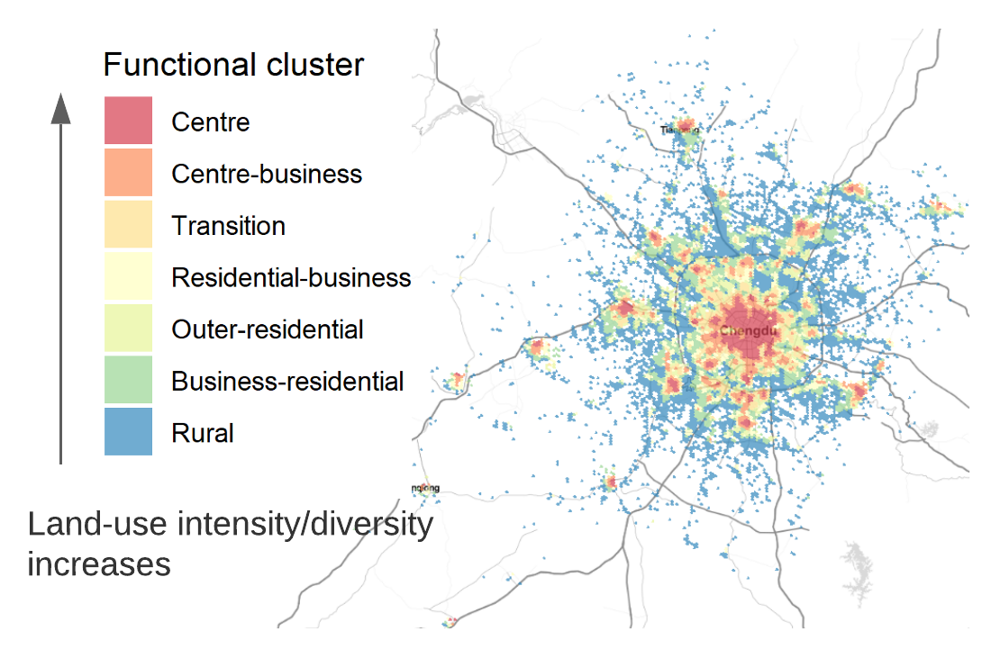

<style>
div.footnotes {
  position: absolute;
  bottom: 0;
  margin-bottom: 10px;
  width: 80%;
  font-size: 0.6em;
}
</style>

<script src="https://ajax.googleapis.com/ajax/libs/jquery/3.1.1/jquery.min.js"></script>
<script>
$(document).ready(function() {
  $('slide:not(.backdrop):not(.title-slide)').append('<div class=\"footnotes\">');

  $('footnote').each(function(index) {
    var text  = $(this).html();
    var fnNum = (index+1).toString();
    $(this).html(fnNum.sup());

    var footnote   = fnNum + '. ' + text + '<br/>';
    var oldContent = $(this).parents('slide').children('div.footnotes').html();
    var newContent = oldContent + footnote;
    $(this).parents('slide').children('div.footnotes').html(newContent);
  });
});
</script>

```{r setup, include=FALSE}
knitr::opts_chunk$set(echo = FALSE)
library(emojifont)
```

## What is human mobility?

The geographic displacement of human beings in space and time, seen as **individuals** or **groups**.
<footnote> Barbosa et al., 2018</footnote>

<div id="images">
  <figure>
      <figcaption><p><small>Fig. 1 Individual movements.</small></p></figcaption>
      
  </figure>
  <figure>
      <figcaption><p><small>Fig. 2 Trips from groups of people.</small></p></figcaption>
      
  </figure>
</div>

## How is human mobility supported by transport systems? {.build}
<div>
Through a variety of transport modes, e.g.,

<br>
<center>
{width=40%}
<br>
<span class="badge badge-pill badge-info">ride-sourcing</span> <span class="badge badge-pill badge-info">public transit</span> <span class="badge badge-pill badge-info">private car</span>
</center>
</div>

<br>
<div>
<p>**Transport modal disparities**</p>
- <p>Carbon intensity</p>
- <p>Spatiotemporal distributions of travel time and trips</p>
</div>

## Background {.build}

<div style="float: left; width: 50%;">
- <p>Transportation presents a major challenge to curbing climate change.</p>
- <p>Better informed policymaking requires up-to-date empirical data with **good quality**, **low cost**, and **easy access**.</p>
- <p>Emerging data sources enable deep and new insights from large-scale collection of **human movement** and **transport systems**.</p>
</div>

<div style="float: right; width: 50%;">
<p><small>Fig. 3 Tweets and road networks (car + public transit) in Stockholm region</small></p>
<center>{width=100%}</center>
</div>

## Research questions and present work {.build}

<div>
1. What are the potentials and limitations of using emerging data sources for modelling mobility?

2. How can new data sources be properly modelled for characterising transport modal disparities?
</div>

<div>
<table class="table table-hover">
  <thead>
    <tr>
      <th scope="col">RQ</th>
      <th scope="col">#</th>
      <th scope="col">Scope</th>
      <th scope="col">Paper title</th>
    </tr>
  </thead>
  <tbody>
    <tr class="table-light">
      <th scope="row">1</th>
      <td>I</td>
      <td>Population heterogeneity</td>
      <td>From individual to collective behaviours: exploring population heterogeneity of human mobility based on social media data</td>
    </tr>
    <tr class="table-light">
      <th scope="row"></th>
      <td>II</td>
      <td rowspan="2" style="vertical-align : middle;">Travel demand</td>
      <td>Feasibility of estimating travel demand using geolocations of social media data</td>
    </tr>
    <tr class="table-light">
      <th scope="row"></th>
      <td>III</td>
      <td>A mobility model for synthetic travel demand from sparse individual traces</td>
    </tr>
    <tr class="table-active">
      <th scope="row">2</th>
      <td>IV</td>
      <td>Travel time</td>
      <td>Disparities in travel times between car and transit: spatiotemporal patterns in cities</td>
    </tr>
    <tr class="table-active">
      <th scope="row"></th>
      <td>V</td>
      <td>Modal competition</td>
      <td>Ride-sourcing compared to its public-transit alternative using big trip data</td>
    </tr>
  </tbody>
</table>
</div>

## Methodology {.columns-2}
<center>{width=90%}<p><small>Fig. 4 Methodology</small></p></center>

<br>
<br>
<table class="table table-hover">
  <thead>
    <tr>
      <td rowspan="2" style="vertical-align : middle;">Method</td>
      <td colspan="5"><center>Paper</center></td>
    </tr>
    <tr>
      <th scope="col">I</th>
      <th scope="col">II</th>
      <th scope="col">III</th>
      <th scope="col">IV</th>
      <th scope="col">V</th>
    </tr>
  </thead>
  <tbody>
    <tr class="table-light">
      <th scope="row">Data mining</th>
      <th scope="col">`r emoji('heavy_check_mark')`</th>
      <th scope="col"></th>
      <th scope="col"></th>
      <th scope="col"></th>
      <th scope="col">`r emoji('heavy_check_mark')`</th>
    </tr>
    <tr class="table-light">
      <th scope="row">Mobility metrics and models</th>
      <th scope="col">`r emoji('heavy_check_mark')`</th>
      <th scope="col">`r emoji('heavy_check_mark')`</th>
      <th scope="col">`r emoji('heavy_check_mark')`</th>
      <th scope="col">`r emoji('heavy_check_mark')`</th>
      <th scope="col">`r emoji('heavy_check_mark')`</th>
    </tr>
    <tr class="table-light">
      <th scope="row">Methods in transport geography</th>
      <th scope="col"></th>
      <th scope="col"></th>
      <th scope="col"></th>
      <th scope="col">`r emoji('heavy_check_mark')`</th>
      <th scope="col">`r emoji('heavy_check_mark')`</th>
    </tr>
  </tbody>
</table>

## RQ1 Potentials and limitations of geotagged tweets {.build}
<table>
  <tbody>
    <tr>
      <th scope="row"><center>{width=80%}</center></th>
      <td><p><h4>Geotagged tweets</h4><br><h6>The tweets with precise location information (GPS coordinates) when Twitter users actively choose to tag it.</h6></p></td>
    </tr>
  </table>
</table>

<div>    
- <p>Why Twitter?</p>

  - <p>Easy access, low cost, large spatial and population coverage.</p>
</div>

<div> 
- <p>Limitations of geotagged tweets</p>

  - <p>Biased population: young, highly-educated, urban residents.</p>
  - <p>**Sparse sampling** of the actual mobility.</p>
  - <p>**Behaviour bias** of reporting geolocations.</p>
</div>
## Limitations: sparse sampling of the actual mobility {.build}
- <p>Twitter users DO NOT geotweet every day.</p>
- <p>Twitter users DO NOT geotweet every location visited.</p>

<center>{width=80%}<p><small>Fig. 5 Sparsity issue.<footnote>Data used in Paper III</footnote></small></p></center>

## Limitations: behaviour bias of overly reporting leisure/night activities {.build}

<div> 
Uncommon places and leisure activities >> regularly visited places, e.g., home and workplace.
</div>

<div> 
<center>{width=80%}<p><small>Fig. 6 Behaviour bias.<footnote>Data used in Paper I</footnote></small></p></center>
</div>

## Limitations: not for commuting travel demand estimation {.build}

<div> 
The reliability of estimated commuting trips using geotagged tweets is low.<footnote>Paper II</footnote>
</div>

<div style="float: left; width: 65%;">
<p><small>Fig. 7A Commuting matrices.</small></p>

<center>{width=100%}</center>
</div>

<div style="float: right; width: 34%;">
<p><small>Fig. 7B Commuting trip distance distributions.</small></p>

<center>{width=100%}</center>
</div>

## Potentials at individual level: population heterogeneity on mobility {.build}

<div style="float: left; width: 50%;">
<p><small>Fig. 8 Four types of travellers.<footnote>Paper I</footnote></small></p>

<center>{width=100%}</center>
</div>

<div style="float: right; width: 50%;">
- <p>Local vs. Global traveller visits </p>
  - <p>Local: nearby locations.</p>
  - <p>Global: more distant locations.</p>
</div>

<div style="float: right; width: 50%;">
- <p>Returner vs. Explorer explores around </p>
  - <p>Returner: one centralised location.</p>
  - <p>Explorer: decentralised locations that are distant from each other.</p>
</div>

## Potentials at population level: travel demand modelling {.build}

<span class="badge rounded-pill bg-primary" style="color:white">spatial scale</span> 
<span class="badge rounded-pill bg-secondary" style="color:white">sampling method</span> 
<span class="badge rounded-pill bg-secondary" style="color:white">sample size</span>


<div>
- <p>Twitter data are more suitable for **city level** than national level.</p>
- <p>The main obstacle of using Twitter data at a large spatial scale is the **sparsity**.</p>

<center>{width=35%}<p><small>Fig. 9 National level (left) vs. city level (right).<footnote>Paper II</footnote></small></p></center>

</div>

## Potentials at population level: travel demand modelling {.build}

<div>
<span class="badge rounded-pill bg-secondary" style="color:white">spatial scale</span> 
<span class="badge rounded-pill bg-primary" style="color:white">sampling method</span> 
<span class="badge rounded-pill bg-primary" style="color:white">sample size</span>
  
- <p>**User-based** data collection works better than area-based data collection:</p>
<p>A much larger number of geotagged tweets, a more complete picture of travel demand.</p>
</div>

<div style="float: left; width: 33%;">
<span class="badge rounded-pill bg-primary" style="color:white">A density-based approach</span> 
<span class="badge rounded-pill bg-secondary" style="color:white">A mobility model</span>

- <p>**A density-based approach** is proposed to increase sample size:</p>
</div>

<div style="float: right; width: 66%;">
<p><small>Fig. 10 Trip-based approach (left)<footnote>Lee et al., 2019</footnote> vs. density-based approach (right).<footnote>Paper II</footnote></small></p>
<center>{width=95%}</center>
</div>

## Extending the use by innovative approaches {.build}
<div>
<span class="badge rounded-pill bg-secondary" style="color:white">A density-based approach</span> 
<span class="badge rounded-pill bg-primary" style="color:white">A mobility model</span>

- <p>**An individual-based mobility model**<footnote>Paper III</footnote> fills the gaps in sparse mobility data, particularly geolocations of social media data.</p>
- <p>The model is designed to correct behaviour bias and sparsity issue.</p>
</div>

<div>
<table style="white-space:nowrap;width:100%;">
  <tr>
    <td><p style="font-size:24px">**Input**- sparse mobility traces <br>that can not be directly converted to trips.</p></td>
    <td rowspan="2"><center>{width=65%}</center></td>
  </tr>
  <tr>
    <td><p style="font-size:24px">**Output**- synthesised mobility <br>converted to daily trips.</p></td>
  </tr>
</table>
</div>

## Extending the use by innovative approaches {.build}
<div>
<span class="badge rounded-pill bg-secondary" style="color:white">A density-based approach</span> 
<span class="badge rounded-pill bg-primary" style="color:white">A mobility model</span>

- <p>The model-synthesised results have good agreements with the other data sources.</p>
</div>

<div>
- <p>An application: characterising trip distance distributions (domestic) of global regions:</p>

<center>{width=100%}<p><small>Fig. 11 Distributions of synthesised domestic trips.<footnote>Paper III</footnote></small></p></center>
</div>

## RQ2 Transport modal disparities
### Movements in context, data beyond geotagged tweets
<center>{width=60%}</center>

## Spatiotemporal patterns of travel time {.build}
<div style="float: left; width: 40%;">
Data fusion framework for travel time calculation<footnote>Paper IV</footnote>:

<center>{width=100%}</center>
</div>

<div style="float: right; width: 57%;">
Distribution of geotagged tweets represents the dynamic attractiveness of locations in cities.

<center>{width=60%}<p><small>Fig. 12 Geotagged tweets as destinations by hour of day (Stockholm region).</p></small></center>
</div>

## Spatiotemporal patterns of travel time {.build}
<div style="float: left; width: 50%;">
<center><p><small>Fig. 13 Travel time ratio by hour of day (Sydney).</p></small></center>
<center>{width=80%}</center>

Spatiotemporal dynamics of travel time ratio (R)<footnote>Paper IV</footnote>.
</div>

<div style="float: right; width: 50%;">
<center><p><small>Fig. 14 Travel time ratio over 24 hours.</p></small></center>
<center>{width=80%}</center>

- <p>Travel time by PT is around twice as high as by car.</p>
- <p>PT can compete with car use during peak rush hours in Stockholm and Amsterdam.</p>

</div>

## Modal competition: ride-sourcing vs. public transit {.build}
<div>
<table>
  <tbody>
    <tr>
      <th scope="row"><center>{width=80%}</center></th>
      <td><p><h4>Does ride-sourcing complement, or compete with, public transit?</h4></p></td>
    </tr>
  </table>
</table>
</div>

<div>

- <p class="text-info">How large is the share of ride-sourcing trips that can be **substituted** by taking public transit, if you are willing to walk up to **800 m** to access and leave the transit station during daytime?</p>

</div>

<div>
- <p>Ride-sourcing trips: transit-competing vs. non-transit-competing.</p>
  - <p>What **trip attributes** and **built environment** are linked to the competition?</p>
  - <p>What are the implications for policymaking?</p>
</div>

## Modal competition: ride-sourcing vs. public transit {.build}
<div>
- <p>The transit-competing trips account for 48.2%.</p>
</div>

<div>
<center><p><small>Fig. 15 Hot spots of ride-sourcing trips.<footnote>Paper V</footnote></p></small></center>
<center>{width=100%}</center>

- <p>The non-transit-competing trips tend to have a more spread-out distribution of pick-up and drop-off hot spots, including the international airport.</p>
</div>

## Data fusion approaches {.build}

<div>
<span class="badge rounded-pill bg-secondary" style="color:white">For travel time calculation</span> 
<span class="badge rounded-pill bg-primary" style="color:white">For open trip data analysis</span>
</div>

<div>
- <p>Collected from a large area and population but at a cost of rich detail.</p>
- <p>Raw data: trip ID, pick-up and drop-off locations, pick-up and drop-off times, and cost.</p>
</div>

<div>
<center><p><small>Fig. 16 Data enrichment for ride-sourcing trip data.<footnote>Paper V</footnote></p></small></center>

<center>{width=95%}</center>
</div>

## Modal competition: ride-sourcing vs. public transit {.build}
### Model and impact of travel time and public-transit transfer
<div>
<p>A glass-box model enhanced by machine learning techniques: **additive** impact of **factors** and factor **interactions**.</p>
</div>

<div style="float: left; width: 55%;">
<p><small>Fig. 17 Impact of travel time by ride-sourcing (left) and transfer (right).<footnote>Paper V</footnote></p></small><center>{width=100%}</center>
</div>

<div style="float: right; width: 44%;">
- <p>Competition is more likely to happen when the **travel time** by ride-sourcing < 15 min.</p>
- <p>Requiring multiple **transfers** is associated with the competition between.</p>
</div>

## Modal competition: ride-sourcing vs. public transit {.build}
### Impact of land-use patterns
<div style="float: left; width: 31%;">
<p>Land-use clusters of the study area.</p>
<center>{width=100%}</center>
</div>


<div style="float: right; width: 68%;">
<center><p><small>Fig. 18 Impact of land-use cluster and its interaction with transfer.<footnote>Paper V</footnote></p></small>{width=82%}</center>

- <p>Low density/diversity of **land use** -> a lower probability of competition.</p>
- <p>Multiple **transfers** + middle density/diversity of **land use** -> a higher probability of competition.</p>
</div>

## Modal competition: ride-sourcing vs. public transit {.build}
### Selective recommendations
<div>
- <p>`r emoji('airplane')` Improve PT services that provide access to the international airport (informed by ride-sourcing hot spots);</p>
</div>

<div>
- <p>`r emoji('bus')` Expand PT networks guided by the transit-competing ride-sourcing trips featuring short travel time but a big gap between the two modes;</p>
</div>

<div>
- <p>`r emoji('moneybag')` Incentivise the ride-sourcing trips that fill the gaps in the PT services that take a long time or require lengthy walking and transfers connecting to suburban areas.</p>
...
</div>

## A summary of answers {.build}
### RQ1 Potentials and limitations for modelling mobility

<div>
- <p>`r emoji('o')` `r emoji('heavy_exclamation_mark')` Easy access, low cost, but with biased population, behaviour bias, and sparsity issue.</p>
</div>

<div>
- <p>`r emoji('bust_in_silhouette')` At the individual level, fundamental patterns are preserved.</p>
</div>

<div>
- <p>`r emoji('busts_in_silhouette')` At the population level: </p> 
  - <p>a reasonably good source for the overall travel demand estimation but not commuting demand.</p>

  - <p>careful consideration on spatial scale, sampling method, and sample size.</p>
</div>

<div>
- <p>`r emoji('wrench')` Innovative approaches for correcting the biases and increasing available data.</p>
</div>

## A summary of answers {.build}
### RQ2 Characterising transport modal disparities

<div>
- <p>`r emoji('package')` Importance of data fusion approaches, especially given more and more open but incomplete data.</p>
</div>

<div>
- <p>{width=3%} Geotagged tweets is a good source for time-varying attractiveness of urban locations.</p>
</div>

<div>
- <p>`r emoji('bus')` `r emoji('car')` Public transit is virtually always slower than car and ride-sourcing.</p>
</div>

<div>
- <p>`r emoji('round_pushpin')` For making public transit more competitive, spatiotemporal details add nuanced insights to identify gaps and opportunities.</p>
</div>

## Outlook {.build}
<div>
- <p>{width=3%} Extending the use of social media data for mobility modelling.</p>
  - <p>De-biasing the data source.</p>
  - <p>Long-distance travels.</p>
  - <p>Combining the textual information with the location part.</p>
</div>

<div>
- <p>`r emoji('globe_with_meridians')` Generating global synthetic mobility data for improving travel demand projections.</p>
  - <p>Bigger picture: energy systems' modelling for the transport sector.</p>
</div>

## Outlook {.build}
<div>
- <p>`r emoji('blue_car')` & `r emoji('tram')` `r emoji('bike')` `r emoji('taxi')` `r emoji('bus')` `r emoji('train')` Combining multi-modal trip data for reducing transport carbon emissions.</p>
  - <p>Occupancy, shareability, and electrification of new mobility services provided by transportation network companies (TNCs).</p>
</div>

<div>
- <p>`r emoji('spider_web')` Introducing the perspective of networks.</p>
  - <p>The relationship between user/traveller friendship networks (abstract) and their mobility networks (spatial).</p>
  - <p>How social segregation and spatial interactions shape each other?</p>
</div>

## Thanks for listening! {data-background="figs/end_background.png"}
Yuan Liao

`r emoji('e-mail')`  yuan.liao@chalmers.se

{width=3%} @TheYuanLiao

`r emoji('globe_with_meridians')` https://yuanliao.netlify.app/

<br>

<div style="float: left; width: 70%;">
`r emoji('green_book')`Thesis available online

https://research.chalmers.se/en/publication/523982
</div>

<div style="float: right; width: 30%;">
{width=50%}
</div>
